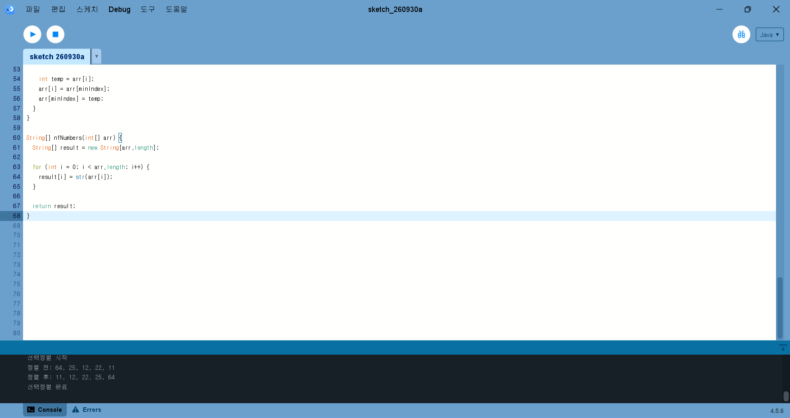

### 실행 결과


# 알고리즘 2026

## 숙제 1. 선택정렬

### 소스 코드

[원본 파일 열기](./homework/SelectionSorting.pde)

```java

int[] numbers = {64, 25, 12, 22, 11};

void setup() {
  size(600, 400);

  println("선택정렬 시작");
  println("정렬 전: " + join(nfNumbers(numbers), ", "));

  selectionSort(numbers);

  println("정렬 후: " + join(nfNumbers(numbers), ", "));
  println("선택정렬 완료");
}

void draw() {
  background(255);

  fill(30);
  textSize(24);
  text("Selection Sort", 30, 40);

  int barWidth = 80;
  int gap = 25;
  int startX = 40;
  int baseY = 300;

  for (int i = 0; i < numbers.length; i++) {
    int x = startX + i * (barWidth + gap);
    int barHeight = numbers[i] * 3;

    fill(70, 140, 220);
    rect(x, baseY - barHeight, barWidth, barHeight);

    fill(0);
    textSize(18);
    text(numbers[i], x + 25, baseY + 25);
  }

  textSize(16);
  text("Sorted from smallest to largest", 30, 360);
}

void selectionSort(int[] arr) {
  for (int i = 0; i < arr.length - 1; i++) {
    int minIndex = i;

    for (int j = i + 1; j < arr.length; j++) {
      if (arr[j] < arr[minIndex]) {
        minIndex = j;
      }
    }

    int temp = arr[i];
    arr[i] = arr[minIndex];
    arr[minIndex] = temp;
  }
}

String[] nfNumbers(int[] arr) {
  String[] result = new String[arr.length];

  for (int i = 0; i < arr.length; i++) {
    result[i] = str(arr[i]);
  }

  return result;
}
```

---
## 숙제 1. 선택정렬

### 실행 결과


## 숙제 2. 정렬 과제

### 소스 코드

[원본 파일 열기](./homework/Sorting.pde)

```java
ArrayList<Array> lists;
Array list, plist;
int type=0, napTime=100, len=16, index=0, loop=0;
boolean autoFlag=true;
String[] titles = {"selectionSort", "bubbleSort", "insertSort", "mergeSort", "quickSort"};
PFont f;

void setup() {
  size(900, 600);  
  f = createFont("Arial-BoldMT-48.vlw", 24);
  textFont(f);
  lists = new ArrayList<Array>();
  lists.add(new Array(len, 0, 0));
  list = lists.get(0);
  list.printArray();
  run(type);
  list = lists.get(loop);
  list.printArray();
}

void draw() {
  background(200);
  list = lists.get(index);
  list.draw();
  fill(0);
  text("("+nf(list.i0,2)+","+nf(list.j0,2)+") - "+index+"/"+loop, 20, height-20);
  text(titles[type], 20, 40);
  if(autoFlag) nextStep();
}

void nextStep() {
  delay(napTime);
  if(index<loop) index++;
  else index=0;
}

void keyPressed() {
  if(key == ' ') {
    autoFlag = !autoFlag;
  }
  else if (key == CODED) {
    if (keyCode == LEFT) {
      if(index>0) index--;
    } else if (keyCode == RIGHT) {
      if(index<loop) index++;
    } 
  }
}

void mousePressed() {
  if(mouseButton == LEFT) {
    if(index>0) index--;
  }
  else if(mouseButton == RIGHT) {
    if(index<loop) index++;
  }
}

void run(int type) {
  if (type==0) selectionSort();
  else if (type==1) bubbleSort();
//  else if (type==2) insertSort();
//  else if (type==3) mergeSort();
//  else if (type==4) quickSort();  
}

void selectionSort() {
  int i, j, max, index, tlen=len;
  for (i=0; i<len; i++) {
    plist = lists.get(i);
    lists.add(new Array(len, plist.arr, i+1, 0));
    loop++;
    list = lists.get(i+1);    
    max=-1;
    index=-1;
    for (j=0; j<tlen; j++) {
      if (max<list.arr[j]) {
        max=list.arr[j];
        index=j;
      }
    }
    if (index!=-1) swap(list.arr, index, tlen-1);
    tlen--;
  }
}

void bubbleSort() {
  int i, j;
  for (j=0; j<len-1; j++) {
    plist = lists.get(loop);
    lists.add(new Array(len, plist.arr, j+1, 0));
    loop++;
    list = lists.get(loop);    
    for (i=0; i<len-j-1; i++) {
      plist = lists.get(loop);
      lists.add(new Array(len, plist.arr, j+1, i));
      loop++;
      list = lists.get(loop);    
      if (list.arr[i] > list.arr[i+1])
        swap(list.arr, i, i+1);
    }
  }
}

/*
void insertSort() {
  int i, j, temp, last = list.size();
  for (i=1; i<last; i++) {
    temp=list.get(i);
    for (j=i-1; j>=0 && temp<list.get(j); j--) {
      list.set(j+1, list.get(j));
    }
    list.set(j+1, temp);
    drawAndDelay();
  }
}

void mergeSort() {
  mergeSort(0, list.size()-1);
}

void mergeSort(int low, int high) {
  if (low < high) {
    int middle = low + (high - low) / 2;
    mergeSort(low, middle);
    mergeSort(middle + 1, high);
    merge(low, middle, high);
    drawAndDelay();
  }
}

void merge(int low, int middle, int high) {
  int i, j, k;
  i = low;
  j = middle + 1;
  k = low;
  for (i = low; i <= high; i++) {
    tlist.set(i, list.get(i));
    while (i <= middle && j <= high) {
      if (tlist.get(i) <= tlist.get(j)) {
        list.set(k, tlist.get(i));
        i++;
      } 
      else {
        list.set(k, tlist.get(j));
        j++;
      }
      k++;
    }
    while (i <= middle) {
      list.set(k, tlist.get(i));
      k++;
      i++;
    }
  }
}

void quickSort() {
  quickSort(0, list.size()-1);
}

void quickSort(int low, int high) {
  int i = low, j = high;
  int pivot = list.get(low+(high-low)/2);
  while (i <= j) {
    while (list.get(i) < pivot) i++;
    while (list.get(j) > pivot) j--;
    if (i <= j) {
      swap(i, j);
      i++;
      j--;
    }
  }
  if (low < j) quickSort(low, j);
  if (i < high) quickSort(i, high);
  drawAndDelay();
}
*/

void swap(int[] arr, int i, int j) {
  int tmp=arr[j];
  arr[j] = arr[i];
  arr[i] = tmp;
}
```

---

## 과제 README


### 소스 코드

```java
int[][] gridData = {
  {29, 10, 14, 37, 13, 24, 11, 33},
  {29, 10, 14, 33, 13, 24, 11, 37},
  {29, 10, 14, 11, 13, 24, 33, 37},
  {24, 10, 14, 11, 13, 29, 33, 37},
  {13, 10, 14, 11, 24, 29, 33, 37},
  {13, 10, 11, 14, 24, 29, 33, 37},
  {11, 10, 13, 14, 24, 29, 33, 37},
  {10, 11, 13, 14, 24, 29, 33, 37}
};

// 각 숫자별 색상 지정 (0: 기본 검정, 1: 빨간색, 2: 파란색)
int[][] colorData = {
  {0, 0, 0, 0, 0, 0, 0, 0},
  {0, 0, 0, 1, 0, 0, 0, 2},
  {0, 0, 0, 1, 0, 0, 2, 2},
  {1, 0, 0, 0, 0, 2, 2, 2},
  {1, 0, 0, 0, 2, 2, 2, 2},
  {0, 0, 1, 2, 2, 2, 2, 2},
  {1, 0, 2, 2, 2, 2, 2, 2},
  {1, 2, 2, 2, 2, 2, 2, 2}
};

int rows = 8;
int cols = 8;
float cellWidth = 60;
float cellHeight = 45;
float startX = 100;
float startY = 150;

void setup() {
  size(700, 600);
  background(255);
  
  // 제목 텍스트
  fill(0);
  textAlign(LEFT, TOP);
  textSize(32);
  text("Selection Sorting", 50, 50);
  
  // 표 및 숫자 그리기
  textAlign(CENTER, CENTER);
  textSize(18);
  
  for (int r = 0; r < rows; r++) {
    for (int c = 0; c < cols; c++) {
      float x = startX + c * cellWidth;
      float y = startY + r * cellHeight;
      
      // 테두리 선
      stroke(220);
      strokeWeight(1);
      noFill();
      rect(x, y, cellWidth, cellHeight);
      
      // 텍스트 색상 설정
      if (colorData[r][c] == 1) {
        fill(220, 50, 40);   // 빨간색 (교환된 요소)
      } else if (colorData[r][c] == 2) {
        fill(40, 70, 160);   // 파란색 (정렬 완료된 요소)
      } else {
        fill(0);             // 기본 검정색
      }
      
      // 숫자 출력
      text(gridData[r][c], x + cellWidth/2, y + cellHeight/2);
    }
  }
}
```
# 실행 과제

## 병합정렬 실행 결과


### 소스 코드

```java
// 각 칸의 숫자 데이터 (-1은 빈 칸을 의미)
int[][] gridData = {
  {10, 14, 29, 37, 11, 13, 24, 33},
  {10, -1, -1, -1, -1, -1, -1, -1},
  {10, 11, -1, -1, -1, -1, -1, -1},
  {10, 11, 13, -1, -1, -1, -1, -1},
  {10, 11, 13, 14, -1, -1, -1, -1},
  {10, 11, 13, 14, 24, -1, -1, -1},
  {10, 11, 13, 14, 24, 29, -1, -1},
  {10, 11, 13, 14, 24, 29, 33, -1},
  {10, 11, 13, 14, 24, 29, 33, 37}
};

int rows = 9;
int cols = 8;
float cellWidth = 60;
float cellHeight = 45;
float startX = 150;
float startY = 130;

void setup() {
  size(750, 600);
  background(255);
  
  // 제목 텍스트 (Merge Sorting)
  fill(0);
  textAlign(LEFT, TOP);
  textSize(32);
  text("Merge Sorting", 100, 50);
  
  // 표 및 숫자 그리기
  textAlign(CENTER, CENTER);
  textSize(18);
  
  for (int r = 0; r < rows; r++) {
    for (int c = 0; c < cols; c++) {
      float x = startX + c * cellWidth;
      float y = startY + r * cellHeight;
      
      // 검은색 테두리 선
      stroke(0);
      strokeWeight(1);
      noFill();
      rect(x, y, cellWidth, cellHeight);
      
      // 값이 있는 칸(-1이 아닌 경우)에만 숫자 출력
      if (gridData[r][c] != -1) {
        fill(0); // 검은색 텍스트
        text(gridData[r][c], x + cellWidth/2, y + cellHeight/2);
      }
    }
  }
  
  // 실행 화면을 이미지 파일로 저장
  save("merge_sort.png");
}

void draw() {
  noLoop();
}
```
### 실행결과


### 소스코드

```java
int  n=8;
int  xstep=400;
int  ystep=50;
int  radius=30;
int  mode=0;
int  traversal=0;
int  textcolor=0;
PFont font;

BTree tree = new BTree();
 
void setup() {
  size(1200, 600);

font = createFont("Arial", 16);
  textFont(font, 16);
  textAlign(LEFT, CENTER);
  stroke(192, 0, 0);
  newTree();
}

void mousePressed() {
  if(mouseButton == LEFT) {
    if(tree.value == -1) {
      int x=(int)(100.*mouseX/width);
      tree.insert(x);
      fill(255);
      ellipse(32, 32, radius, radius);
      fill(0);
      text(x, 32, 32);
    }  
    else {
      tree.remove(tree.value);
      fill(255);
      ellipse(32, 32, radius, radius);
      fill(0);
      text(tree.value, 32, 32);
    }  
  } 
}

void mouseReleased() {
  drawTree();
}

void mouseMoved() {
  tree.findNode();
  if(tree.value != -1) {
    fill(92);
    ellipse(tree.x, tree.y, radius, radius);
    fill(0);
    text(tree.value, tree.x, tree.y);
  } 
  else drawTree();
}

void keyPressed() {
  if(key=='c') {
    background(200);
    tree.clear();
  }
  else if(key=='v' || key ==' ') { 
    drawTree();
    tree.printTree();
  }  
  else if(key=='b') {  
    newTree();
  }  
  else if(key=='t') {  
    traversal++;
    if(traversal==3) traversal=0;
    drawMode();
  }  
  else if(key=='d') {  
    if(textcolor==0) textcolor=1;
    else textcolor=0;
    drawTree();
  }  
}

void newTree() {
  tree.clear();
  for(int i=0; i<n; i++) 
    tree.insert((int)random(99));
  drawTree();
}

/*
  println("Contains 1: " + tree.contains(1)); //<>//
  println(tree.root);
  println(tree.insert(1));
  println("Contains 1: " + tree.contains(1));
*/
 
void draw() {
}

void drawMode() {
  int x=20, y=50;
  textFont(font, 24);
  textAlign(LEFT, CENTER);
  noStroke();
  fill(132);
  rect(10, height-y-12, 102, 26);
  fill(0);
  if(traversal==0) text("inorder(t)", x, height-y);
  else if(traversal==1) text("preorder(t)", x, height-y);
  else if(traversal==2) text("postorder(t)", x, height-y);    
  text((int)(100.*mouseX/width)+"  insert", x+100, height-y);
  text("clear tree:c new tree:b draw tree:v or space", x, height-24);
  stroke(192, 0, 0);
  textFont(font, 16);
  textAlign(CENTER, CENTER);
}

void drawTree() {
  background(200);
  tree.assignPosition();
  tree.drawTree();  
  drawMode();
}

class BTree {
  Node root;
  int  x, y, value, index;
   
  void clear() {
    root = null;
  }
 
  boolean contains(int in) {
    return contains(in, root);
  }

  boolean contains(int in, Node curr) {
    if (curr == null) return false;
    if (in < curr.val) return contains(in, curr.left);
    else if (in > curr.val) return contains(in, curr.right);
    else return true;
  }
 
  int findMax() {
    if (isEmpty()) {
      println("The tree was empty! Returning 0 to avoid an error");
      return 0;
    }
    else return findMax(root).val;
  }

  Node findMax(Node curr) {
    if (curr == null) return null;
    else if (curr.right == null) return curr;
    return findMax(curr.right);
  }
 
  int findMin() {
    if (isEmpty()) {
      println("The tree was empty! Returning 0 to avoid an error");
      return 0;
    }
    else return findMin(root).val;
  }

  Node findMin(Node curr) {
    if (curr == null) return null;
    else if (curr.left == null) return curr;
    return findMin(curr.left);
  }
   
  int treeHeight() {
    return treeHeight(root);
  }

  int treeHeight(Node curr) {
    if (curr == null) return -1;
    else return 1+max(treeHeight(curr.left), treeHeight(curr.right));
  }
 
  boolean isEmpty() {
    return root == null;
  }
 
  boolean insert(int in) {
    Node r = insert(in, root);
    if (r == null) return false;
    root = r;
    return true;
  }

  Node insert(int in, Node curr) {
    if (curr == null) return new Node(in);
    Node res = null;
    if (in < curr.val) {
      res = insert(in, curr.left);
      if (res != null)
        curr.left = res;
    }
    else if (in > curr.val) {
      res = insert(in, curr.right);
      if (res != null)
        curr.right = res;
    }
    return res == null ? null : curr;
  }
  
  void remove(int in) {
    root = remove(in, root);
  }

  Node remove(int in, Node curr) {
    if (curr == null) return curr;
    if (in < curr.val) curr.left = remove(in, curr.left);
    else if (in > curr.val) curr.right = remove(in, curr.right);
    else if (curr.left != null && curr.right != null) {
      curr.val = findMin(curr.right).val;
      curr.right = remove(curr.val, curr.right);
    }
    else curr = (curr.left != null) ? curr.left:curr.right;
    return curr;
  }

  void assignPosition() {
    if (!isEmpty()) assignPosition(root, 0, 0);
  }

  void assignPosition(Node curr, float dx, float dy) {
    if (curr != null) {
      assignPosition(curr.left, dx-1./pow(2.,(dy+1.)), dy+1);
      curr.x=dx;
      curr.y=dy;
      assignPosition(curr.right, dx+1./pow(2.,(dy+1.)), dy+1);
    }
  }

  void printTree() {
    fill(0,0,255);
    index=0;
    if (isEmpty()) println("The tree is empty");
    else printTree(root);
  }

  void printTree(Node curr) {
    if (curr != null) {
      if(traversal == 0) {
        printTree(curr.left);
        println(curr.val+" "+index+" ("+curr.x+","+curr.y+")");
        text(index, (int)(curr.x*xstep+width/2-radius/2-2), 
          (int)(curr.y*ystep+radius-radius/2-2));
        index++;
        printTree(curr.right);
      }  
      else if(traversal == 1) {
      }  
      else if(traversal == 2) {
      }  
    }
  }

  void findNode() {
    x = y = value = -1;
    if (isEmpty()) return;
    else findNode(root);
  }

  void findNode(Node curr) {
    if (curr != null) {
      findNode(curr.left);
      int dx=mouseX-(int)(curr.x*xstep+width/2);
      int dy=mouseY-(int)(curr.y*ystep+radius);
      if((dx*dx+dy*dy)<radius*radius/4) {
        x=(int)(curr.x*xstep+width/2);
        y=(int)(curr.y*ystep+radius);
        value=curr.val;
        return;
      }  
      findNode(curr.right);
    }
  }

  void drawTree() {
    if (isEmpty()) println("The tree is empty");
    else {
      drawTreeLine(root);
      drawTree(root);
    }    
  }

  void drawTreeLine(Node curr) {
    if (curr != null) {
      drawTreeLine(curr.left);
      if(curr.left != null) line((int)(curr.x*xstep+width/2), (int)(curr.y*ystep+radius),
        (int)(curr.left.x*xstep+width/2), (int)(curr.left.y*ystep+radius));
      if(curr.right != null) line((int)(curr.x*xstep+width/2), (int)(curr.y*ystep+radius),
        (int)(curr.right.x*xstep+width/2), (int)(curr.right.y*ystep+radius));
      drawTreeLine(curr.right);
    }
  }

  void drawTree(Node curr) {
    if (curr != null) {
      drawTree(curr.left);
      fill(255);
      ellipse(curr.x*xstep+width/2, curr.y*ystep+radius, radius, radius);
      if(textcolor==0) fill(0);
      else fill(255);
      text(curr.val, (int)(curr.x*xstep+width/2), (int)(curr.y*ystep+radius));
      drawTree(curr.right);
    }
  }
}
 
class Node {
  int   val;
  float x, y;
  Node left;
  Node right;
  Node(int v) {
    val = v;
  }

  Node(int v, Node l, Node r) {
    val = v;
    left = l;
    right = r;
  }

  public String toString() {
    if (left == null && right == null) return "N(" + val + ")";
    return "N(" + val + ", " + left + ", " + right + ")";
  }
}
