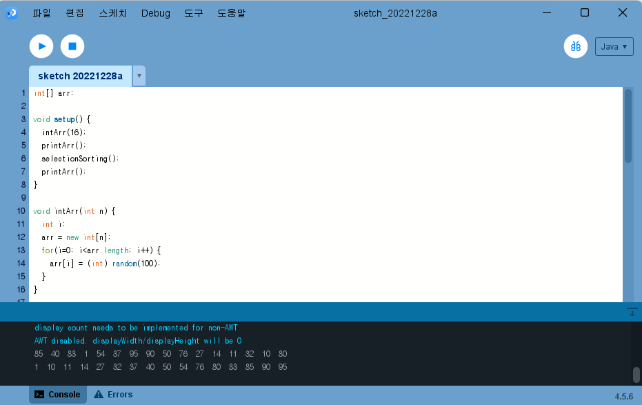

# 알고리즘 2026

알고리즘 과제 모음입니다.

---

## 숙제 1. 선택정렬 (Selection Sort)

### 실행 결과

### 소스 코드

[SelectionSorting.pde 코드 보기](./homework/SelectionSorting.pde)

---

## 숙제 2. 정렬 과제 (Sorting)

### 실행 결과

### 소스 코드

[Sorting.pde 코드 보기](./homework/Sorting.pde)

---

## 추가 과제 자료

### 이미지 1

### 이미지 2

---

## 과제 파일 목록

- [선택정렬](./homework/SelectionSorting.pde)
- [Sorting 과제](./homework/Sorting.pde)
- [과제 README](./homework/README.md)
